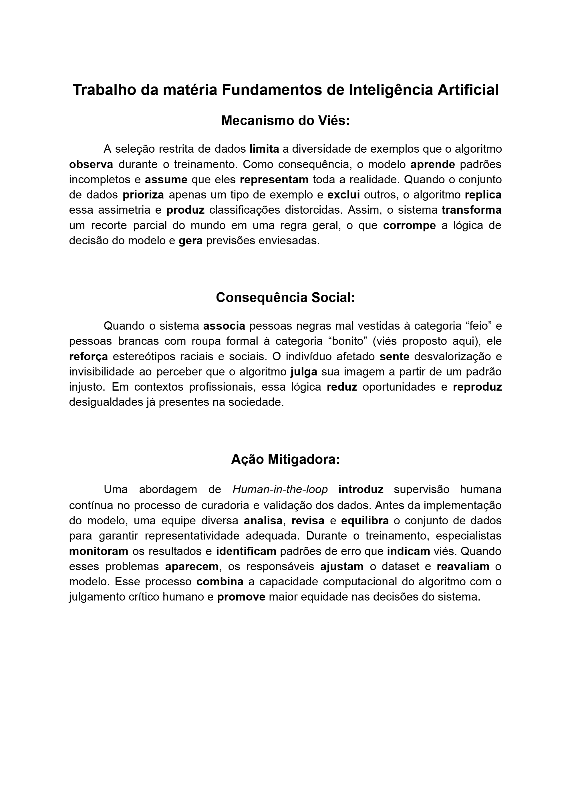
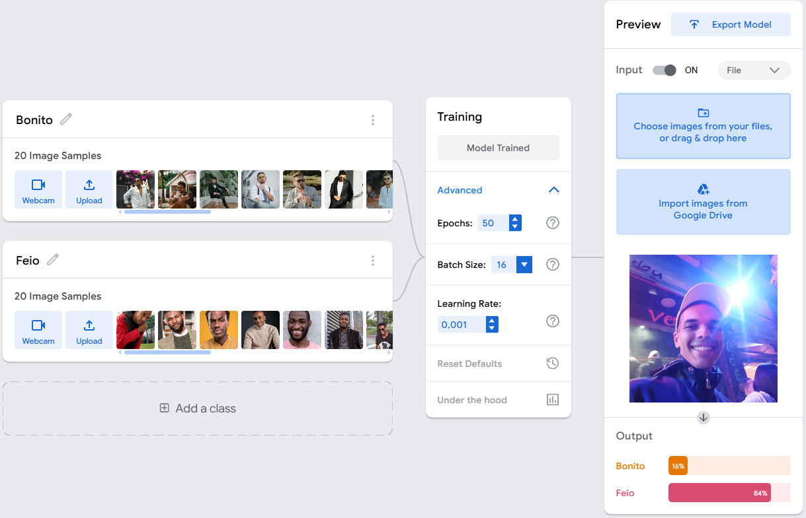

# 🧠 Laboratório de Classificação Visual

> Projeto acadêmico desenvolvido na disciplina de **Fundamentos de Inteligência Artificial** com foco em **visão computacional**, análise de **vieses algorítmicos** e impactos sociais.

---

## 🎯 Objetivo do Projeto

Este laboratório analisa como modelos de classificação visual podem desenvolver padrões enviesados quando treinados com conjuntos de dados limitados ou mal distribuídos. O experimento demonstra como a IA pode reproduzir estereótipos sociais ao associar características visuais a categorias subjetivas.

---

## 🖼 Demonstração do Modelo

### 🔹 Interface de Treinamento

### 🔹 Análise Teórica do Viés Algorítmico

---

## ⚙️ Tecnologias Utilizadas

---

## 🧪 Funcionamento do Experimento

O modelo foi treinado com duas categorias para expor o viés:

| Classe | Característica predominante no Dataset |
| :--- | :--- |
| **`Bonito`** | Pessoas brancas utilizando roupas formais |
| **`Feio`** | Pessoas negras utilizando roupas simples |

**Resultado:** O sistema passou a associar padrões sociais incorretos às classificações, evidenciando problemas críticos de representatividade.

---

## ⚠️ Mecanismo do Viés e Impacto Social

A seleção restrita de dados faz com que o algoritmo assuma padrões incompletos como "verdade absoluta". Sistemas assim podem:
- Reforçar estereótipos raciais;
- Gerar **exclusão algorítmica**;
- Produzir decisões injustas em processos seletivos ou segurança.

---

## 🛡 Estratégia de Mitigação

Para reduzir esses erros, o projeto propõe:
- **Curadoria ética**: Diversidade real nos datasets.
- **Human-in-the-loop**: Supervisão humana contínua.
- **Auditoria**: Validação periódica das decisões do modelo.

---

## 📚 Aprendizados

- Treinamento de modelos de IA (Classificação);
- Ética aplicada à tecnologia;
- Identificação de vieses em Big Data;
- Impactos sociais da automação.

---

## 📌 Considerações Finais

A Inteligência Artificial **não é neutra**. Ela é um reflexo dos dados que fornecemos. Este laboratório reforça a necessidade urgente de responsabilidade ética no desenvolvimento de sistemas inteligentes.
